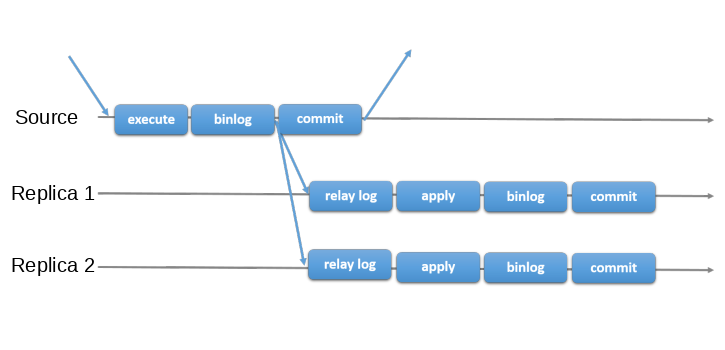
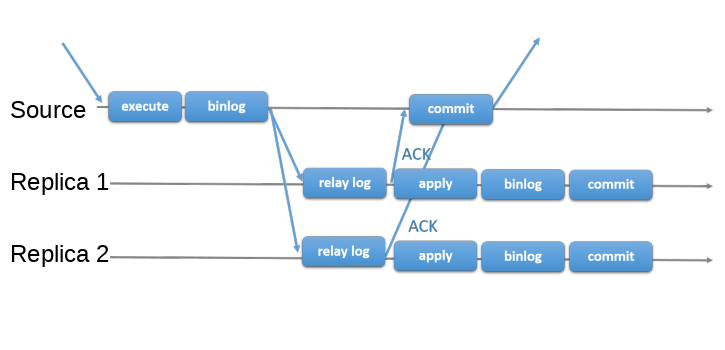

# SavageGrowth
## 帮助程序员找到适合自己的“成长框架”
念念不忘必有回响，持续更新中...

# <架构设计>
**软件架构定义（之一）：** 软件架构式解释该系统所需的结构体的集合，其中包括：软件元素、元素之间的相互关系，以及二者各自的属性。 
* 架构是必须在项目早期作出的一组设计决策。这通常也被非正式的称为“那些在项目后期难以改变的内容”。
* 架构是对系统恰如其分的施加约束，一遍系统获得我们所需质量属性的一门艺术。
* 架构并不仅仅只是设计的宏观部分，如果细节关乎系统的整体质量，那么这些细节也应该属于架构层面的内容。
* 任何软件系统都有自己的架构，架构是客观存在的。

**参考资料：**
《恰如其分的软件架构》

### 微服务架构
**微服务定义：** 微服务是由以单一应用程序构成的小服务，自己拥有独立的进程，服务依赖业务功能的设计，以全自动的方式部署，与其他服务使用轻量级的通信（例如HTTP）。同时服务会使用最小的规模的集中管理能力，服务可以用不同的编程语言与数据库等组件实现。

微服务架构是一种架构风格。

### GoF的23种设计模式

### 面向对象设计原则
最基本的五大设计原则（SOLID）：单一职责原则、开放封闭原则、里式替换原则、接口隔离原则和依赖倒置原则。

### 业务系统设计的基本原则

**1. 可维护性是根本**
* 代码可读性很关键
* 设计权衡时优先考虑简单设计
* 打造可扩展系统

**2. 多参考业界的成功模式**
* GoF的23种设计模式
* 面向对象的X大设计原则
* 业界现有的设计案例

**3. 稳定性是底线**
* 充分了解背后的非功能性诉求
* 尽可能做到可降级
* 实现异常出口

**4. 选择最恰当的设计方案**
* 中间件的设计方式不一定适合业务系统
* 方案选型要考虑团队的技能水位
* 方案要符合项目当前的发展阶段（超前设计需谨慎）
* 重点评估方案的维护成本
* 多套方案中选择最合适的方案

## <云原生>
**定义：** 云原生技术有利于各组织在公有云、私有云和混合云等新型动态环境中，构建和运行可弹性扩展的应用。云原生的代表技术包括容器、服务网格、微服务、不可变基础设施和声明式API。这些技术能够构建容错性好、易于管理和便于观察的松耦合系统。结合可靠的自动化手段，云原生技术使工程师能够轻松地对系统作出频繁和可预测的重大变更。云原生计算基金会（CNCF）致力于培育和维护一个厂商中立的开源生态系统，来推广云原生技术。我们通过将最前沿的模式民主化，让这些创新为大众所用。

**参考资料：**
* https://github.com/cncf/toc/blob/master/DEFINITION.md
* https://jimmysong.io/kubernetes-handbook/cloud-native/cloud-native-definition.html

### Docker

### Service Mesh

### Serverless
**定义：** 无服务器应用程序利用现代云计算功能和抽象的优势，让您专注于逻辑而不是基础架构。在无服务器环境中，您可以专注于编写应用程序代码，而基础平台则负责扩展，运行时，资源分配，安全性以及其他“服务器”方面的细节。无服务器工作负载是“事件驱动的工作负载，与服务器基础结构通常处理的方面无关。” 诸如“要运行多少个实例”和“使用什么操作系统”之类的问题都由功能即服务平台（或FaaS）管理，从而使开发人员可以自由地专注于业务逻辑。

**特性:**
1. 带触发器的事件驱动代码执行
2. 平台处理所有开始，停止和缩放的琐事
3. 缩放为零，空闲时成本低至零
4. 无状态

**参考资料：** 
https://spring.io/serverless

## <存储>

### RDS

#### MySQL
**MGR** 
即MySQL Group Replication，是官方提供的MySQL高可用解决方案。我们知道创建容错系统的常见方式是使组件冗余，对于MySQL而言，最终的挑战是将数据复制的逻辑与多个服务器以一致且简单的方式进行协调的逻辑相融合。换句话说，要让多个服务器就系统的状态以及系统所经历的每一次更改的数据达成一致。 
MGR为分布式状态机复制提供了服务器之间的强大协调能力，当服务器属于同一组时，它们会自动进行协调。该组可以在具有自动选主（单主）的模式下运行，仅一个服务器接受更新。对于更高级的用户，可以在多主模式下部署，在该模式下，所有服务器都可以接受更新，这种能力的代价是应用程序必须解决此类部署所施加的限制。 
所有这些均由组通信系统（Group Communication System，即GCS）协议提供支持，它提供故障检测机制，组成员安全且有序的传递消息，该技术的核心是Paxos算法的实现。

**经典MySQL异步复制和MGR之间的区别**
MySQL异步复制：MySQL提供了两种异步复制机制，一种是“异步复制”，即主执行事务，提交事务，然后将它们稍后（因此异步）发送到从副本以重新执行（在基于语句的复制中）或应用（在基于行的复制中）. 
 
另一种是“半同步复制”，即主执行事务，在等待从服务器确认已接收到事务后再提交事务。 
 

**binlog、redolog、undolog** 

**参考资料：** 
https://dev.mysql.com/doc/refman/8.0/en/group-replication.html

### NoSQL
NoSQL常见的四种类型：键值对型、文档型、列式存储型和图型。

#### Redis
**定义：** Redis是一种采用内存来作为数据结构存储的数据库、缓存和消息代理。 
**部署说明：** Redis是用ANSI C编写，并且可以在大多数POSIX系统中使用，例如Linux，* BSD，OS X，而无需外部依赖。Linux和OS X是Redis开发和测试最多的两个操作系统，我们建议使用Linux进行部署。 
**支持的数据结构：** 字符串，哈希，列表，集合，带范围查询的排序集合，位图，HyperLogLog，地理空间索引。 
**持久化方案：**
Redis持久化方案分为RDB和AOF两种。 
RDB：按指定的时间间隔执行数据集的时间点快照。 
AOF：会记录服务器接收的每个写入操作，这些操作将在服务器启动时再次播放，以重建原始数据集。使用与Redis协议本身相同的格式记录命令，并且采用追加方式。当日志太大时，Redis可以在后台重写日志。 

注意，可以在同一实例中同时合并AOF和RDB。在这种情况下，当Redis重新启动时，将使用AOF文件用于重建原始数据集，因为它可以保证是最完整的。

**RDB优势：** 
1. RDB是Redis数据的非常紧凑的单文件时间点表示。RDB文件非常适合备份。可以在灾难发生时轻松将数据恢复到不同版本。
2. 支持文件上传来远程恢复。
3. RDB最大限度地提高了Redis的性能，因为Redis父进程为了持久化而需要做的唯一工作就是forking一个子进程，其余的都交给子进程来做，父实例将永远不会执行磁盘I/O或类似操作。
4. 与AOF相比，采用RDB方式来重启Redis将更快。

**RDB劣势：** 
1. 在断电等没有正确关闭的情况下停止工作之后）存在数据丢失的可能。
2. RDB需要经常使用fork()才能使用子进程将其持久化在磁盘上。如果数据集很大，Fork()可能很耗时，如果机器CPU性能不佳，则可能导致Redis停止为客户端服务几毫秒甚至一秒钟。AOF也需要fork()，但我们可以控制重写日志的频率，而无需权衡持久性。

**AOF优势：** 
1. 使用AOF Redis更加持久：您可以使用不同的fsync策略：完全没有fsync，每秒fsync，每个查询fsync。使用fsync的默认策略，每秒的写入性能仍然很好（fsync是使用后台线程执行的，并且当没有fsync进行时，主线程将尽力执行写入操作。）但是您只能损失一秒钟的写入时间。
2. AOF以易于理解和解析的格式包含所有操作的日志。您甚至可以轻松导出AOF文件，在某些情况下，便于我们分析Redis的所有操作。

**AOF劣势：** 
1. 对于同一数据集，AOF文件通常大于等效的RDB文件。
2. 精确的fsync策略可能会导致AOF可能比RDB慢。通常情况下，设置每秒一次fsync性能仍然很高，并且在禁用fsync的情况下，即使在高负载下，它也应与RDB一样快。即使在巨大的写负载的情况下，RDB仍然能够提供有关最大延迟的更多保证。
3. AOF通过像MySQL或MongoDB那样增量地更新现有状态来工作，而RDB快照一次又一次地创建所有内容，从概念上讲，它更健壮。

如果您要增加一个计数器100次，最终将在数据集中包含最终值的键只有一个，而在AOF中却包含100个条目。不需要其中的99个条目来重建当前状态。因此，Redis支持一个有趣的功能：它能够在后台重建AOF，而不会中断对客户端的服务。每当您发出BGREWRITEAOF时， Redis都会编写最短的命令序列来重建内存中的当前数据集。如果您将AOF与Redis 2.2一起使用，则需要不时运行BGREWRITEAOF。Redis 2.4能够自动触发日志重写。

**复本机制：** 
1. Redis支持主从模式，默认采用异步复制的方式，如果对强一致性有要求，可以使用同步复制。
2. Redis支持将多个副本连接到同一主副本，并且副本还可以按级联结构连接到其他副本。从Redis 4.0开始，所有子副本将从主服务器接收完全相同的数据流。
3. Redis复制时在Master上是无阻塞的。这意味着当一个或多个副本执行初始同步或部分重新同步时，主服务器将继续处理查询。

**高可用：** 
Redis官方提供的高可用方案分为Redis Sentinel和Redis Cluster两种。 
Redis Sentinel 
这是宏观上Sentinel功能的完整列表（即，大图）：
* 监控。Sentinel会不断检查您的主实例和副本实例是否按预期工作。
* 通知。Sentinel可以通过API通知系统管理员或其他计算机程序，其中一个受监视的Redis实例出了问题。
* 自动故障转移。如果主服务器未按预期工作，则Sentinel可以启动故障转移过程，在该过程中将副本升级为主服务器，将其他附加副本重新配置为使用新的主服务器，并通知使用Redis服务器的应用程序要使用的新地址。连接时。
* 配置提供程序。Sentinel充当客户端服务发现的权威来源：客户端连接到Sentinels，以询问负责给定服务的当前Redis主服务器的地址。如果发生故障转移，Sentinels将报告新地址。

1. 当多个哨兵就给定的主机不再可用这一事实达成共识时，将执行故障检测。这降低了误报的可能性。
2. 即使不是所有的Sentinel进程都在工作，Sentinel仍能正常工作，从而使系统能够应对故障。毕竟，拥有故障转移系统本身就是一个单点故障，这没有任何意思。
3. 一个健壮的部署至少需要三个Sentinel实例。
4. Sentinels，Redis实例（主服务器和副本）以及连接到Sentinel和Redis的客户端的总和也是具有特定属性的大型分布式系统。

**扩展知识点：** HyperLogLog
**参考资料：** 
* https://redis.io/
* http://doc.redisfans.com/

## <基础框架>
### Spring
Spring中最核心的接口是BeanFactory，它是我们访问Spring Bean容器的根接口，里面定义了很多通过名字或类型来获取Bean的方法，BeanFactory提供了一种高级配置机制，能够管理任何类型的对象。 
Spring中另一个核心接口是ApplicationContext，它是BeanFactory的子接口，它提供了如下功能：
1. 与Spring的AOP功能轻松集成
2. 消息资源处理（用于国际化）
3. 事件发布
4. 应用层特定的上下文，例如WebApplicationContext用于Web应用程序中的。

简而言之，BeanFactory提供了配置框架和基本功能，并ApplicationContext增加了更多针对企业的功能。

#### IoC
org.springframework.beans和org.springframework.context包是Spring框架的IoC容器的基础。

#### AOP
Spring通过使用基于Schema的方法或@AspectJ注释样式，提供了编写自定义方面的简单而强大的方式。 
**核心概念** 
切面（Aspect）：横跨多个类的关注点的模块化 
连接点（Join point）：程序执行期间的一个点，在Spring AOP中，连接点总是表示一个方法的执行。 
增强（Advice）：一个切面在特定连接点所采取的操作。不同类型的建议包括“around”、“before”和“after”增强。许多AOP框架，包括Spring，都将一个增强建模为一个拦截器，并在连接点周围维护一个拦截器链。
切入点（Ponitcut）：匹配连接点的谓词。Advice与切入点表达式相关联，并在与切入点匹配的任何连接点上运行（例如，使用特定名称的方法的执行）。与切入点表达式匹配的连接点的概念是AOP的核心，Spring默认使用AspectJ切入点表达式语言。
目标对象(Target object)：一个或多个方面建议的对象。也称为“建议对象”。由于Spring AOP是使用运行时代理实现的，因此该对象始终是代理对象。
AOP代理(AOP proxy)：由AOP框架创建的一个对象，用于实现切面合同（增强方法执行等）。在Spring Framework中，AOP代理是JDK动态代理或CGLIB代理。

Spring AOP并未想和AspectJ竞争以提供全面的AOP解决方案，而是和Spring IoC和AspectJ结合，Spring AOP默认将标准JDK动态代理用于AOP代理。这使得可以代理任何接口（或一组接口）。Spring AOP也可以使用CGLIB代理。这对于代理类而不是接口是必需的。默认情况下，如果业务对象未实现接口，则使用CGLIB。

## <常见工具>
### Arthas

## < JVM >
### 运行时数据区域
线程私有的内存区域有程序计数器、Java虚拟机栈和本地方法栈，程序计数器是Java虚拟机规范中唯一没有要求OOM的地方；线程公用的有堆和方法区，方法区在JDK8之前的HotSpot叫做永久代，在JDK8以及之后叫做元数据区，元数据区作为直接内存来管理，只受操作系统内存的限制。

### 垃圾收集算法
主要是标记-清除、标记-复制和标记-整理三种。 
**标记-清除** 该算法有两个缺点，一个是效率不稳定，如果大量对象都需要标记和清除的话，开销会比较大，另一个是会导致碎片化严重，导致给新对象分配内存空间时需要进行碎片整理，增加了运行时内存分配的成本。 
**标记-复制** 如果每次只有少量对象存活（例如新生代内的对象就是如此），那么只需要保留（复制）这少量对象就行了，所以有人提出了该算法，“半区复制”（Semispace Copying）的垃圾收集算法，它将可用内存按容量划分为大小相等的两块，每次只使用其中的一块。当这一块的内存用完了，就将还存活着的对象复制到另外一块上面，然后再把已使用过的内存空间一次清理掉。 
**标记-整理** 如果每次都会有大量对象存活（例如老年代），那么标记-复制算法需要复制的对象数量将很多，标记过程仍然与“标记-清除”算法一样，但后续步骤不是直接对可回收对象进行清理，而是让所有存活的对象都向内存空间一端移动，然后直接清理掉边界以外的内存。

### 垃圾收集器
大多数垃圾收集器都遵循分代收集理论（G1除外），一般把堆分为新生代和老年代。

部分收集（Partial GC）：指目标不是完整收集整个Java堆的垃圾收集。
新生代收集（Minor GC/Young GC）：指目标只是新生代的垃圾收集。
老年代收集（Major GC/Old GC）：指目标只是老年代的垃圾收集。目前只有CMS收集器会有单独收集老年代的行为。另外请注意“Major GC”这个说法现在有点混淆，在不同资料上常有不同所指，读者需按上下文区分到底是指老年代的收集还是整堆收集。
混合收集（Mixed GC）：指目标是收集整个新生代以及部分老年代的垃圾收集。目前只有G1收集器会有这种行为。
整堆收集（Full GC）：收集整个Java堆和方法区的垃圾收集。

新生
新生代收集器Parallel Scavenge

  
**参考资料：**
深入理解Java虚拟机：JVM高级特性与最佳实践（第3版）

## < IO >
### 零拷贝

**参考资料：**
https://developer.ibm.com/articles/j-zerocopy/
https://www.linuxjournal.com/article/6345

### 伪共享

